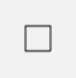
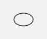
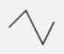
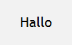
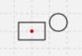

[Zurück](Nikolaus.md)

---

# Zum Zeichnen geometrischer Formen

Wir haben schon einige Ausdrucksmöglichkeiten gesehen.
Ein allgemeinerer Überblick mit Beispielen:

* `rectangle (30,20)`  
  Führt zu:  
  

* `square 20`  
  Führt zu:  
  

* `circle 10`  
  Führt zu:  
  

* `oval (30,20)`  
  Führt zu:  
  

* `path [ (0,0), (15,15), (30,-15), (40,5) ]`  
  Führt zu:  
  

* `text "Hallo"`  
  Führt zu:  
  

Da außer bei (absolut positioniertem) `path` die Formen zunächst immer um den Koordinatenursprung `(0,0)` zentriert sind, ist `move` nützlich.
Zum Beispiel:

```elm
scene _ _ =
   [ rectangle (30,20)
   , move (30,10) (circle 10)
   ]
```

Führt zu:  


