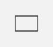

[Zurück](Nikolaus.md)

---

# Zum Zeichnen geometrischer Formen

Wir haben schon einige Ausdrucksmöglichkeiten gesehen.
Ein allgemeinerer Überblick mit Beispielen:

* `rectangle (30,20)`  
  
* `square 10`
* `circle 10`
* `oval (10,20)`
* `path [ (0,0), (15,-15), (30,15) ]`
* `text "Hallo"`

Da außer bei (absolut positioniertem) `path` die Formen zunächst immer um den Koordinatenursprung `(0,0)` zentriert sind, ist `move` nützlich.
Zum Beispiel:

```elm
scene _ _ =
   [ rectangle (10,20)
   , move (30,10) (circle 10)
   ]
```

