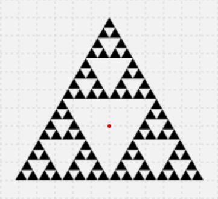

[Zurück](Kreativ.md)

---

# Zusatzaufgabe(n)

Vervollständige folgendes Programm:

```elm
scene _ _ =
  group
  [ sierpinski 4 ]

sierpinski i = 
  if i > 0
    then
      let 
        s = group
            [ sierpinski (i-1) ]
            |> scale 0.5
      in
        ...
    else
      ngon 3 120

main = display (400,300) scene Nothing
```

so dass `sierpinski i` jeweils die `i`. Stufe des [Sierpinski-Dreiecks](http://de.wikipedia.org/wiki/Sierpinski-Dreieck) darstellt, wobei der Umkreisradius des Gesamtdreiecks gleich `120` sein soll.

[Datei](https://raw.githubusercontent.com/jvoigtlaender/Elm-Kurs/master/task-files/Playgroundx.elm), [@share-elm](http://share-elm.com/sprout/553a8883e4b06aacf0e89841/0.15/view)

Hinweise:

* Der Ausdruck `ngon 3 120` beschreibt die (ausgefüllte) Fläche eines regelmäßigen `3`-Ecks mit Umkreisradius `120`.

* Analog zu `|> move ...` wirkt `|> scale ...` auf ein beliebiges Teilbild, verschiebt dieses jedoch nicht, sondern streckt/staucht es.

* Die Beziehung zwischen Seitenlänge `a` und Umkreisradius `r` in einem gleichseitigen Dreieck beträgt `a = r * sqrt(3)`. Außerdem gilt, dass der Inkreisradius halb so groß wie der Umkreisradius ist.

Zielbild, für `i = 4`:



Zusatz: Setze eine andere fraktale Darstellung um. Als Inspiration mag [dies hier](http://jvoigtlaender.github.io/Elm-Kurs/examples/DancingTree.html) dienen. Nützlich ist als weitere "Bildmanipulation" neben `|> move ...` und `|> scale ...` auch noch `|> rotate ...`.

