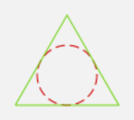

[Zurück](Re-Use.md)

---

# Dritte Aufgabe

Male ein gleichseitiges, grünes Dreieck mit einbeschriebenem, rot gestricheltem Berührkreis, so dass dieser den Radius 25 hat.  

* Hinweis zum Styling:  
  Von den Funktionen `rectangle`, `square`, `circle`, `oval`, `path` gibt es Varianten, die uns das Aussehen der gezeichneten Linien verändern lassen.
  Während zum Beispiel `rectangle' (solid black) (30,20)` äquivalent zum schon gesehenen `rectangle (30,20)` ist, geht auch `rectangle' (dashed red) (30,20)`:  
    
  oder auch etwa `oval' (dotted blue) (30,20)`:  
    
  Eine Übersicht vorhandener Farben und Möglichkeiten zur Erzeugung neuer findet man bei Bedarf [hier](http://package.elm-lang.org/packages/elm-lang/core/latest/Color).

* Geometrischer Hinweis:  
  Die Beziehung zwischen Seitenlänge `a` und Inkreisradius `r` in einem gleichseitigen Dreieck beträgt `r = a/sqrt(12)`. Außerdem gilt für die Höhe des Dreiecks `h = 3*r`.

Zielbild:

Dann: Schreibe und verwende eine Funktion, welche diese Aufgabe nicht nur für Radius 25 löst.  

---

Beispielausdrücke zur Erinnerung:

* `circle 10`
* `path [ (0,0), (15,15), (30,-15), (40,5) ]`

---

[Weiter](Kreise.md)

