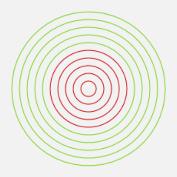

[Zurück](Inkreis.md)

---

# Vierte Aufgabe

Vervollständige, um 10 konzentrische Kreise zu malen, von denen die inneren fünf rot, die äußeren fünf grün sind:

```elm
form i = ...

scene _ _ =
  group
  [ form 1
  , form 2
  , form 3
  , form 4
  , form 5
  , form 6
  , form 7
  , form 8
  , form 9
  , form 10
  ]

main = show scene Nothing
```

[share-elm](http://share-elm.com/sprout/54fcb943e4b0d720e25d602b)

Zielbild, etwa:



---

Beispiel zur Erinnerung Styling:

* `circle' (solid red) 10`

---

[Weiter](Maus.md)

