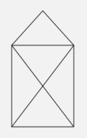

[Zurück](Start.md)

---

# Erste Aufgabe

Vervollständige, um das Haus des Nikolaus zu malen:

```elm
scene _ _ =
  group
  [ rectangle (100,130)
  , path [ (-50,-65), (50,65) ]
  ]

main = display (400,300) scene Nothing
```

[share-elm](http://share-elm.com/sprout/54fcb824e4b0d720e25d6026)

Zielbild, etwa:



Zusatz 1: Male einen kleinen Kreis um die Hausspitze.

Hinweis: Ein Teilbild kann an eine beliebige Position verschoben werden mit `image |> move (x,y)`, wobei `image` der Ausdruck ist, der das Bild beschreibt, und `(x,y)` die Angabe, um wie viel in x- bzw. y-Richtung verschoben werden soll.

Zusatz 2: Stelle "Mario" (`image (45,45) "http://elm-lang.org/imgs/mario/stand/right.gif"`) links neben das Haus. 

---

[Weiter](Forms.md)

